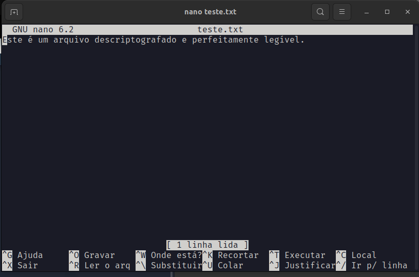

# Desafio Dio - Entendendo um Ransomware na Prática com Python

## O que é Ransomware?

É um tipo de malware de sequestro de dados, feito por meio de criptografia, que usa como refém arquivos pessoais da própria vítima e cobra resgate para reestabelecer o acesso a estes arquivos.

O ransomware é um tipo de malware que criptografa os arquivos de um computador e exige que o usuário pague uma quantia em dinheiro para recuperar o acesso aos seus arquivos. O ransomware é uma ameaça crescente, e as empresas e os indivíduos devem tomar medidas para se proteger.


#### **Como funciona um Ransomware?**

Um ransomware geralmente funciona criptografando os arquivos de um computador usando uma chave privada que só o desenvolvedor do ransomware conhece. O ransomware então exibe uma mensagem exigindo que o usuário pague uma quantia em dinheiro para receber a chave privada e recuperar o acesso aos seus arquivos.

O ransomware pode ser distribuído de várias maneiras, incluindo e-mail, mensagens instantâneas, downloads maliciosos e sites de phishing.


#### **Como se proteger de um Ransomware?**

Existem algumas medidas que você pode tomar para se proteger de um ransomware:

- Mantenha seu sistema operacional e seus aplicativos atualizados.
- Use um firewall e um antivírus atualizado.
- Não abra e-mails ou mensagens instantâneas de fontes desconhecidas.
- Não baixe software de sites não confiáveis.
- Faça backup dos seus arquivos regularmente.


#### **Como analisar um Ransomware com Python?**

O Python é uma linguagem de programação poderosa que pode ser usada para analisar malware. Existem várias bibliotecas Python disponíveis que podem ser usadas para analisar ransomware, incluindo:

- **PEfile:** Uma biblioteca para analisar arquivos PE (Portable Executable), que são o formato de arquivo usado pelos executáveis do Windows.
- **cryptography:** Uma biblioteca para criptografia e descriptografia.
- **yara:** Uma biblioteca para criar e executar regras YARA, que são usadas para identificar malware.


#### **Exemplo de código Python para analisar um Ransomware**

O seguinte código Python pode ser usado para analisar um arquivo ransomware:

python

```python
import pefile
import cryptography
import yara

# Carregar o arquivo ransomware
pe = pefile.PE("ransomware.exe")

# Analisar o cabeçalho do arquivo PE
print("Cabeçalho do arquivo PE:")
print(pe.DOS_HEADER)
print(pe.NT_HEADERS)

# Analisar as seções do arquivo PE
print("Seções do arquivo PE:")
for section in pe.sections:
    print(section.Name, section.SizeOfRawData)

# Analisar os recursos do arquivo PE
print("Recursos do arquivo PE:")
for resource in pe.DIRECTORY_ENTRY_RESOURCE.entries:
    print(resource.name, resource.data.decode("utf-8"))

# Analisar as strings do arquivo PE
print("Strings do arquivo PE:")
for string in pe.get_strings():
    print(string)

# Analisar as funções do arquivo PE
print("Funções do arquivo PE:")
for function in pe.functions:
    print(function.name, function.address)

# Analisar o código do arquivo PE
print("Código do arquivo PE:")
for instruction in pe.disassemble():
    print(instruction)

# Criar uma regra YARA para identificar o ransomware
yara_rule = """
rule ransomware {
    meta:
        description = "Exemplo de regra YARA para identificar ransomware"
    strings:
        $ransom_note = "Pague um resgate para recuperar seus arquivos"
    condition:
        $ransom_note
}
"""

# Compilar a regra YARA
yara_compiler = yara.Compiler()
yara_rules = yara_compiler.compile(source=yara_rule)

# Executar a regra YARA no arquivo ransomware
yara_matches = yara_rules.match(filepath="ransomware.exe")

# Imprimir os resultados da correspondência YARA
print("Correspondências YARA:")
for match in yara_matches:
    print(match.rule, match.namespace)
```


Este código irá analisar um arquivo ransomware e imprimir informações sobre o arquivo, incluindo seu cabeçalho PE, seções, recursos, strings, funções e código. O código também irá criar e executar uma regra YARA para identificar o ransomware.


### Conclusão

O ransomware é uma ameaça crescente, e as empresas e os indivíduos devem tomar medidas para se proteger. O Python pode ser usado para analisar ransomware e identificar as suas características. Isso pode ajudar as organizações a se protege


## O que foi feito nesse projeto?

Primeiro, foi criado um arquivo txt que vai ser encriptado e posteriormente desencriptado.

Também aprendemos como criar o arquivo de encriptação e o de desencriptação.

É necessários usar as bibliotecas: **OS** e **Pyaes** (que é a biblioteca do Python de criptografia).

Na hora de definir a chave de encriptação, nós temos alguns modos de operação para o padrão AES (**Neste código foi usado o CTR**):

- **ECB (Electronic CodeBook)**:

  - No modo ECB, cada bloco de texto plano é cifrado independentemente um do outro. Isso significa que os mesmos blocos de texto plano sempre resultarão nos mesmos blocos cifrados.

  - Embora seja simples de entender e implementar, o modo ECB não é seguro para todos os tipos de dados, especialmente quando há padrões repetitivos no texto plano.

    

- **CBC (Cipher Block Chaining)**:

  - No modo CBC, cada bloco de texto plano é XORed com o bloco cifrado anterior antes de ser cifrado. Isso adiciona uma camada de dependência entre os blocos, tornando a cifra mais segura do que o modo ECB.

  - O CBC requer um vetor de inicialização (IV) para iniciar o processo de encadeamento. O IV deve ser conhecido pelo destinatário para decifrar os dados corretamente.

    

- **CFB (Cipher Feedback)**:

  - No modo CFB, o bloco cifrado anterior é usado para cifrar o próximo bloco de texto plano. Isso cria um fluxo contínuo de blocos cifrados.

    

- **CTR (Counter)**:

  - No modo CTR, um contador é usado para gerar uma sequência de blocos de chave, que são então XORed com o texto plano.

    

- **OFB (Output Feedback)**:

  - No modo OFB, a cifra é usada para criar uma sequência de blocos pseudoaleatórios, que são XORed com o texto plano.

    





# Ransomware-Python

Neste desafio de projeto, implementei um Ransomware para criptografar arquivos utilizando a linguagem Python.
Desafio entregue no curso da DIO -  Santander Bootcamp Cibersegurança


